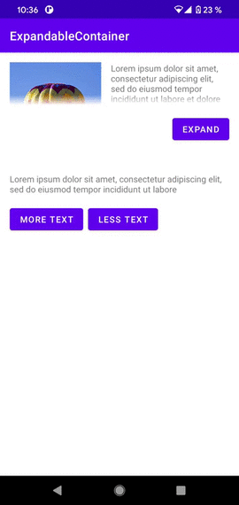

# ExpandableContainer


Custom ViewGroup for Android (API 21+) that supports collapsing/expanding with animation.
Draws fading edge in collapsed state.

# Setup

[](https://jitpack.io/#DarkMinstrel/ExpandableContainer)

### Project build.gradle
```groovy
allprojects {
    repositories {
        ...
        maven { url 'https://jitpack.io' }
    }
}
```
### Module build.gradle
```groovy
dependencies {
    implementation "com.github.darkminstrel:ExpandableContainer:1.0.1"
}
```

# Usage

###  Layout
```xml
<com.darkminstrel.expandable.ExpandableContainer
    android:id="@+id/container"
    android:layout_width="match_parent"
    android:layout_height="wrap_content">

    ...
        
</com.darkminstrel.expandable.ExpandableContainer>
```
### Optional XML attributes
|Name|Default value|Description|
|:---|:---|:---|
|app:expandableExpandedByDefault|false|Defines if the view is expanded by default|
|app:expandableCollapsedHeight|128dp|Height in collapsed state|
|app:expandableShadowHeight|16dp|Height of fading edge|
|app:expandableDuration|200|Animation duration, ms|

### Code
```kotlin
val container = findViewById<ExpandableContainer>(R.id.container)

container.setExpanded(true)
//or
container.toggle()

val isExpanded = container.isExpanded()
```
If child's height is less that provided collapsed height, you might want to hide your toggle button:
```kotlin
val contentFits = container.contentFits()

container.setOnContentFitsChangeListener { contentFits ->
    btnToggle.visibility = if(contentFits) View.GONE else View.VISIBLE
}
```

# License

    Copyright 2021 Dark Minstrel

    Licensed under the Apache License, Version 2.0 (the "License");
    you may not use this file except in compliance with the License.
    You may obtain a copy of the License at

       http://www.apache.org/licenses/LICENSE-2.0

    Unless required by applicable law or agreed to in writing, software
    distributed under the License is distributed on an "AS IS" BASIS,
    WITHOUT WARRANTIES OR CONDITIONS OF ANY KIND, either express or implied.
    See the License for the specific language governing permissions and
    limitations under the License.